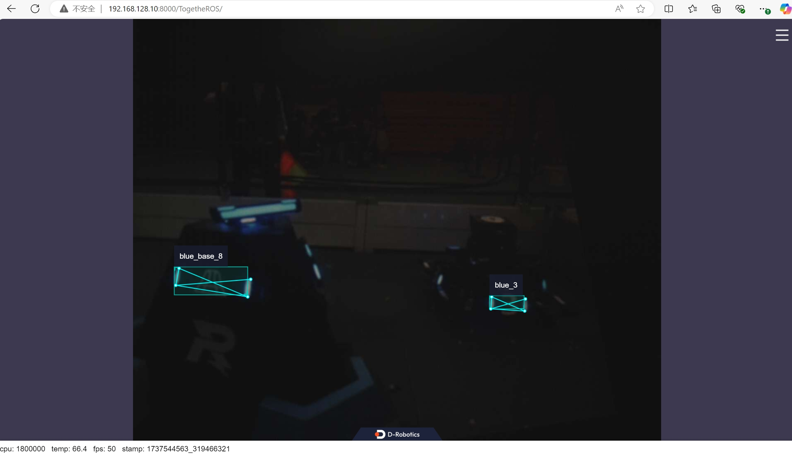

English| [简体中文](./README_cn.md)

Getting Started with rm armor detection demo
=======


# Introduction

The rm armor detection package is an example of using the Dnn Node package. By inheriting the DnnNode virtual base class, it utilizes the YOLOv8s-pose model and image data to perform algorithm inference on a BPU processor.

The image data comes from subscribed image data messages, supporting image data (nv12 format) published using DaHeng cameras(MER-139-210U3C). After the inference is completed, a custom algorithm output parsing method is used to parse the algorithm's output tensor. Once parsed, the intelligent results are published, and real-time rendering effects can be viewed through a web interface.

# Development Environment

- Programming Language: C/C++
- Development Platform: X5
- System Version: Ubuntu 22.04

# Compilation

1. Confirm Compilation Environment

- X5 Ubuntu system is installed on the board.

- The current compilation terminal has set the TROS environment variable: `source /opt/tros/humble/setup.bash`.

- ROS2 compile tool colcon is installed.

2. Compilation

- Compilation command: `colcon build --packages-select rm_armor_detection`

# Usage Guide

##  X5 Ubuntu

```shell
#Set CPU overclocking
cat /sys/devices/system/cpu/cpufreq/policy0/scaling_boost_frequencies
echo 1 >/sys/devices/system/cpu/cpufreq/boost
echo performance >/sys/devices/system/cpu/cpu0/cpufreq/scaling_governor

#Run DaHeng camera
ros2 run rm_camera_driver rm_camera_driver_node

#Run detection node
#If you need to start the WEB display, set the environment variable by 'export WEB_SHOW=TRUE'. Please note that after starting the display, running encoding and decoding functions may cause a decrease in frame rate
ros2 launch rm_armor_detection rm_armor_detection.launch.py
```

## Notes
1. Before starting the function, please set the CPU overclocking to ensure a more stable frame rate
2. The exposure time of the camera will affect the frame rate. Please set an appropriate exposure time
3. Starting the web display will result in a decrease in frame rate. Please ensure that the web display is not started during actual use
4. Ensure normal heat dissipation of the board to avoid frame rate drop caused by high temperature
5. The model was trained using an open-source dataset from the RM community, but due to some issues with the dataset itself, the performance was not particularly good. This case mainly verifies that there is no problem with the overall pathway, and provides rough results and actual data. It is recommended to train with a new dataset for practical use, or use other models for quantitative deployment through the RDK X5 quantization toolchain.

# Results Analysis

## Terminal Output

Log Output:

```text
root@ubuntu:~/rm_ws# ros2 launch rm_armor_detection rm_armor_detection.launch.py
[INFO] [launch]: All log files can be found below /root/.ros/log/2025-01-22-21-42-09-988969-ubuntu-3634
[INFO] [launch]: Default logging verbosity is set to INFO
web_show is  FALSE
Hobot shm pkg enables zero-copy with fastrtps profiles file: /opt/tros/humble/lib/hobot_shm/config/shm_fastdds.xml
Hobot shm pkg sets RMW_FASTRTPS_USE_QOS_FROM_XML: 1
env of RMW_FASTRTPS_USE_QOS_FROM_XML is  1 , ignore env setting
[INFO] [rm_armor_detection-1]: process started with pid [3635]
[rm_armor_detection-1] [BPU_PLAT]BPU Platform Version(1.3.6)!
[rm_armor_detection-1] [HBRT] set log level as 0. version = 3.15.54.0
[rm_armor_detection-1] [DNN] Runtime version = 1.23.10_(3.15.54 HBRT)
[rm_armor_detection-1] [A][DNN][packed_model.cpp:247][Model](2025-01-22,21:42:11.113.724) [HorizonRT] The model builder version = 1.23.5
[rm_armor_detection-1] [WARN] [1737553331.352026854] [dnn_node_sample]: Loaned messages are only safe with const ref subscription callbacks. If you are using any other kind of subscriptions, set the ROS_DISABLE_LOANED_MESSAGES environment variable to 1 (the default).
[rm_armor_detection-1] [WARN] [1737553332.403618074] [dnn_node_sample]: input fps: 71.08, out fps: 71.29, infer time ms: 14, post process time ms: 3
[rm_armor_detection-1] [WARN] [1737553333.410584641] [dnn_node_sample]: input fps: 68.66, out fps: 68.59, infer time ms: 14, post process time ms: 3
[rm_armor_detection-1] [WARN] [1737553334.416761018] [dnn_node_sample]: input fps: 72.71, out fps: 72.56, infer time ms: 13, post process time ms: 3
[rm_armor_detection-1] [WARN] [1737553335.416888954] [dnn_node_sample]: input fps: 71.00, out fps: 71.00, infer time ms: 14, post process time ms: 3
[rm_armor_detection-1] [WARN] [1737553336.426095202] [dnn_node_sample]: input fps: 71.36, out fps: 71.36, infer time ms: 14, post process time ms: 3
[rm_armor_detection-1] [WARN] [1737553337.432650176] [dnn_node_sample]: input fps: 67.59, out fps: 67.59, infer time ms: 14, post process time ms: 3
[rm_armor_detection-1] [WARN] [1737553338.439750294] [dnn_node_sample]: input fps: 72.64, out fps: 72.49, infer time ms: 13, post process time ms: 3
[rm_armor_detection-1] [WARN] [1737553339.447164638] [dnn_node_sample]: input fps: 72.35, out fps: 72.49, infer time ms: 13, post process time ms: 3
[rm_armor_detection-1] [WARN] [1737553340.459308794] [dnn_node_sample]: input fps: 69.93, out fps: 70.16, infer time ms: 14, post process time ms: 3
[rm_armor_detection-1] [WARN] [1737553341.471564468] [dnn_node_sample]: input fps: 73.41, out fps: 73.12, infer time ms: 13, post process time ms: 3
[rm_armor_detection-1] [WARN] [1737553342.481729076] [dnn_node_sample]: input fps: 72.13, out fps: 72.28, infer time ms: 13, post process time ms: 3
[rm_armor_detection-1] [WARN] [1737553343.493939536] [dnn_node_sample]: input fps: 74.26, out fps: 74.11, infer time ms: 13, post process time ms: 3
[rm_armor_detection-1] [WARN] [1737553344.505093429] [dnn_node_sample]: input fps: 72.21, out fps: 72.21, infer time ms: 13, post process time ms: 3
[rm_armor_detection-1] [WARN] [1737553345.517376352] [dnn_node_sample]: input fps: 71.22, out fps: 71.15, infer time ms: 14, post process time ms: 3

```

The log shows that both the frame rates of subscribing image messages and publishing AI messages are around 70fps, with the algorithm taking about 13 milliseconds for single-frame inference and about 3 milliseconds for output parsing.

## Web Display

Web effect screenshot:



Detected target bounding boxes, key points and categories are rendered.

## Data
|           |       |
|----------|-------|
|Frame rate   |75fps  |
|CPU usage    |430%（相机250% + 检测180%）|
|BPU usage    |85%    |
|delay         |60ms   |